# Introduction to DevOps
#### by Rahmad Subagiyo

## Apa itu DevOps
---

DevOps dapat diartikan sebagai kerangka kerja yang menggabungkan kegiatan pengembangan perangkat lunak (Development) dengan kegiatan operasional sistem (Operating System). DevOps dapat membantu dalam peningkatan kepercayaan diri dalam aplikasi yang di bangun, merespons kebutuhan pelanggan dengan lebih baik, dan mencapai tujuan bisnis dengan lebih cepat.

## DevOps Lifecycles

Ada 7 Lifecycles di DevOps atau yang dikenal dengan sebutan The 7 Continuous (The 7C), yaitu :

### 1. Continuous Development

Fase ini memainkan peran penting dalam menggambarkan visi untuk seluruh siklus pengembangan perangkat lunak. Fase ini berfokus pada perencanaan dan pengkodean projek. Selama fase ini, requirement dikumpulkan dan didiskusikan dengan para pemangku kepentingan. Tim Development mulai melakukan coding dengan menggunakan requirement tersebut sebagai acuan. Jadi, tim Development akan terus melakukan development ketika ada perubahan requirement maupun ketika menemui Issue dalam pengerjaan projek tersebut.

### 2. Continuous Integration

Fase selanjutnya adalah Fase Integrasi Berkelanjutan. Dalam fase ini, Tim Development melakukan integrasi terhadap code yang telah diperbaharui, penambahan fitur baru maupun penanganan bug atau issue yang ditemui dalam pengerjaan projek.

### 3. Continuous Testing

Dalam fase ini, coding akan dilakukan pengujian guna untuk menemukan bug, celah ataupun issue yang akan mengganggu jalannya projek yang tengah dibangun. Jika ditemui bug atau issue, maka codingan akan dikembalikan ke fase integrasi untuk diperbaiki

### 4. Continuous Deployment

Setelah codingan dirasa sudah sesuai dengan requirement dari client, maka codingan tersebut, dalam fase ini akan masuk kedalam server produksi. Pada fase ini, Tim pengembangan menjadwalkan pembaharuan untuk server, menjaga agar konfigurasi yang digunakan tetap konsisten selama proses produksi. Fase ini juga tidak menutup kemungkinan adanya penambahan fitur baru yang berkelanjutan selama dalam proses produksi.

### 5. Continuous Feedback

Dalam fase ini, feedback dari Client sangat dibutuhkan untuk pengembangan projek kedepannya. Perusahaan dapat menggunakan pendekatan struktural maupun tidak dalam pengumpulan feedback tersebut. Selama fase ini, feedback dari pelanggan akan dievaluasi secara teratur pada setiap rilis untuk meningkatkan hasil ke titik optimal di masa mendatang. 

### 6. Continuous Monitoring

Selama fase ini, fungsionalitas dan fitur aplikasi akan dipantau terus menerus untuk mendeteksi kesalahan sistem seperti memori yang rendah, server yang tidak dapat dijangkau, dll yang dapat mengganggu kinerja aplikasi tersebut. Proses ini membantu tim IT dalam mengidentifikasi masalah yang terkait dengan kinerja aplikasi dan akar masalahnyanya.

### 7. Continuous Operations

Fase terakhir dalam siklus hidup DevOps sangat penting untuk mengurangi waktu henti yang direncanakan, seperti pemeliharaan server terjadwal. Operasi berkelanjutan bekerja dengan cara mengotomatiskan proses peluncuran aplikasi beserta dengan pembaharuannya. Tujuan utama dari fase ini adalah untuk meningkatkan waktu kerja aplikasi untuk memastikan layanan tidak terganggu.

## Installasi Ubuntu Server menggunakan Multipass

Dalam poin ini, saya menggunakan alternatif dari VmWare, yaitu Multipass dikarenakan ada kendala saat menggunakan command sudo apt update.
Installasi Ubuntu Server di Multipass sangat mudah sekali. Cukup mengikuti panduan yang ada di website Multipass (multipass.run), maka Ubuntu Server akan terinstall dengan mudah di laptop/komputer user.

### 1. Download Multipass

Download aplikasi Multipass ke halaman [Multipass](https://www.multipass.run). Bisa langsung klik Install Now mapun klik tab Install

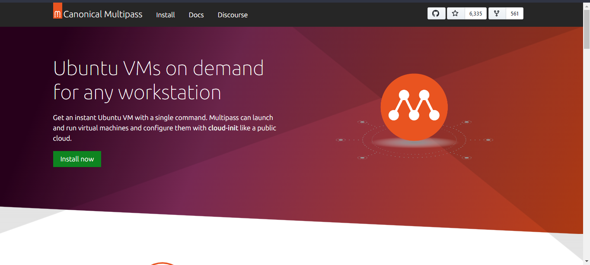

### 2. Pilih OS yang cocok dengan device kita

Karena disini saya pakai Windows, maka saya pilih yang bergambar windows

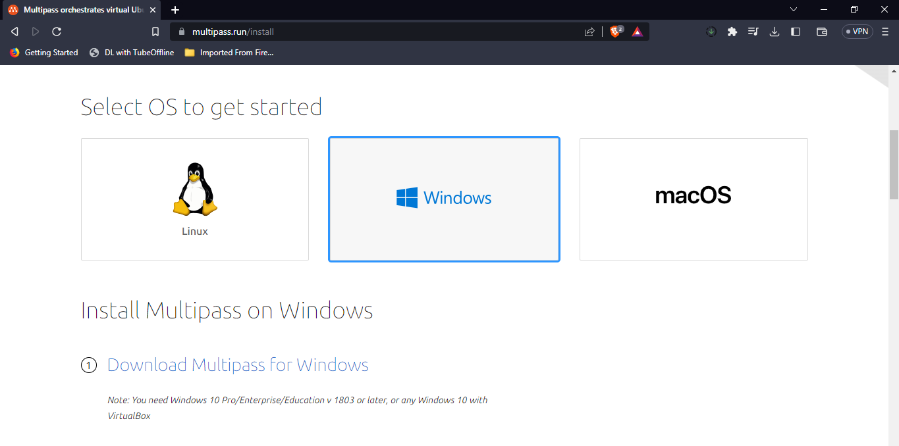

### 3. Setelah berhasil terdownload, double klik pada installer untuk melakukan proses installasi

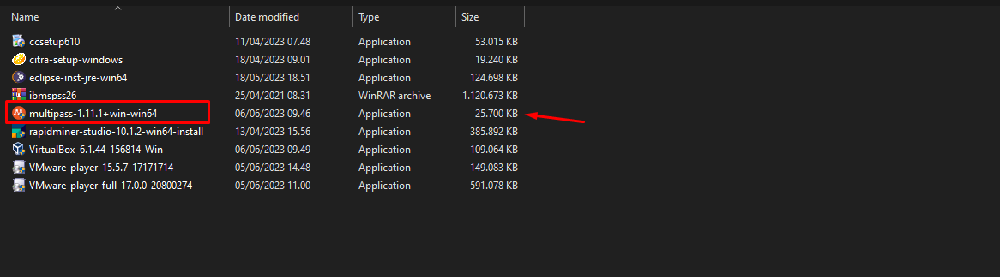

### 4. Lakukan Installasi seperti biasa

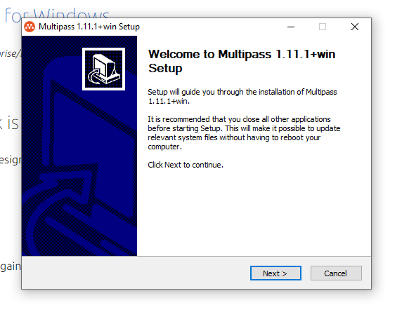

Saya memilih Oracle VM Virtualbox karena di device saya sudah terinstall aplikasi tersebut. Jika mengacu pada guide di [Multipass](https://www.multipass.run), device saya tidak mumpuni jika saya pilih yang Hyper V.
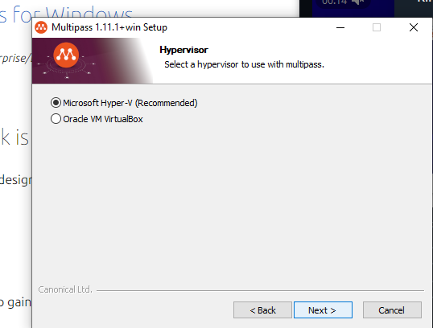
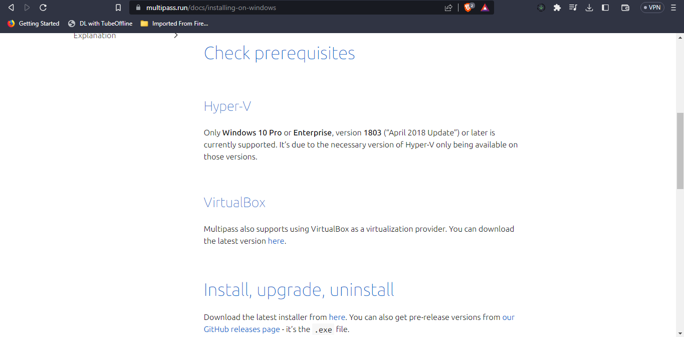

Jika Installasi berhasil, maka akan muncul seperti ini

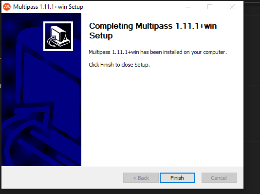

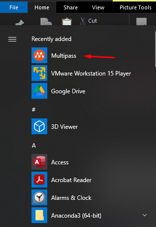 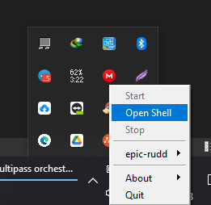

Untuk mengecek versi yang berhasil terinstall, gunakan command `multipass version`. Untuk melihat list instance, gunakan command `multipass list`

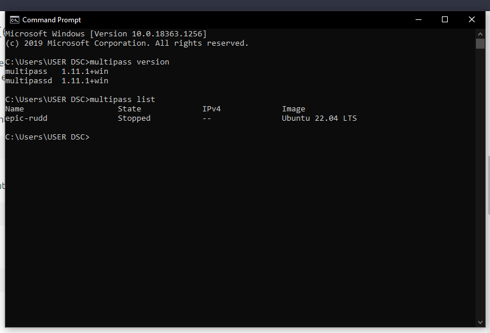

Begini tampilan instance yang telah di install

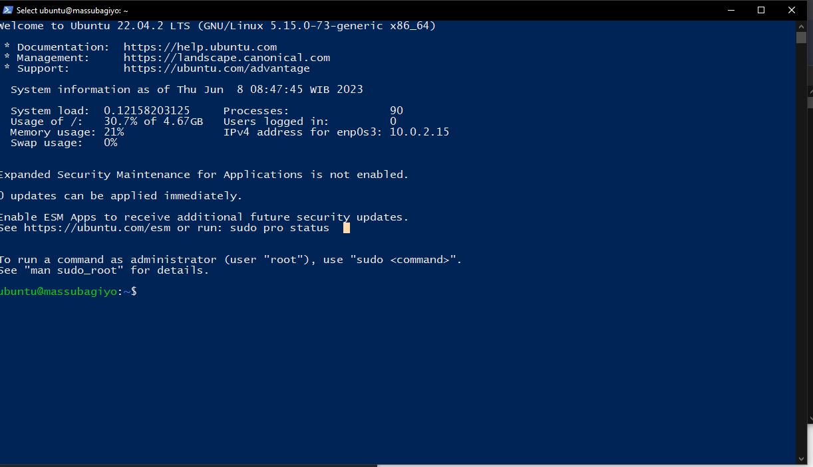

Jalankan command `sudo apt update` agar repository selalu terupdate

