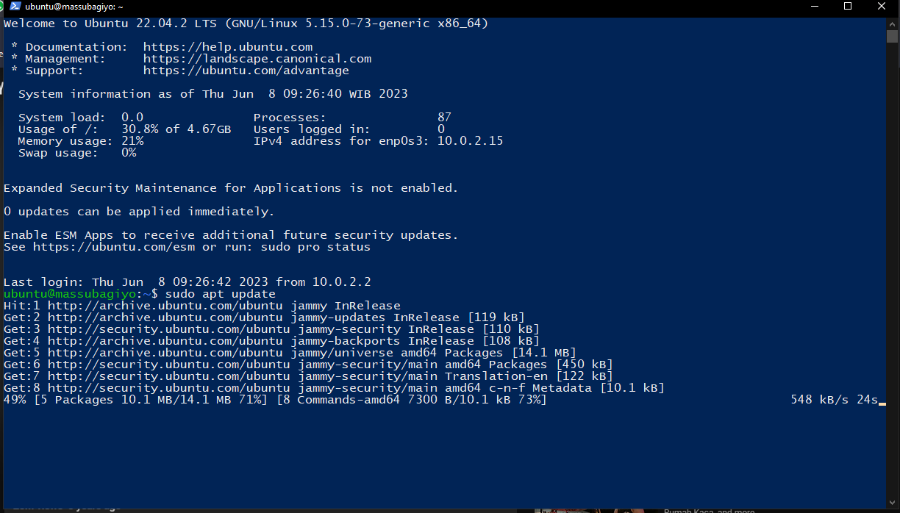
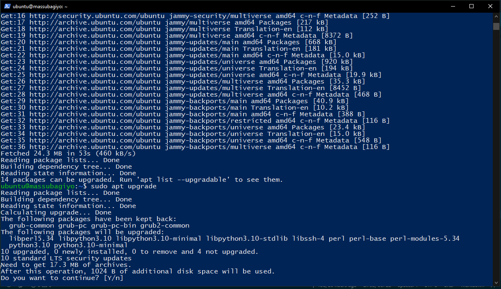
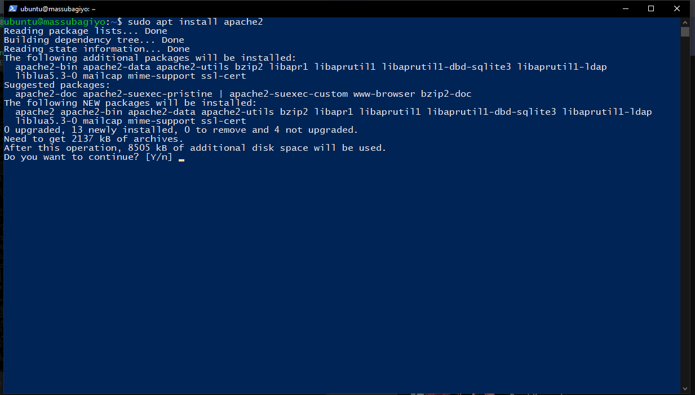
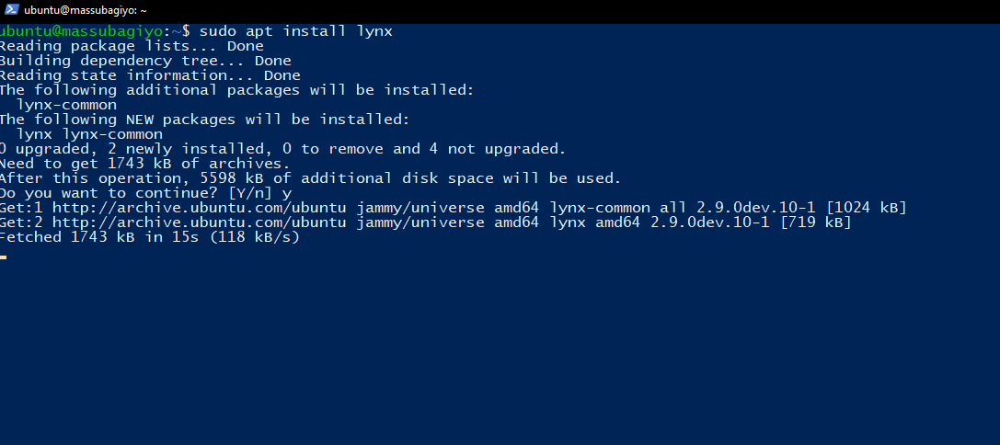
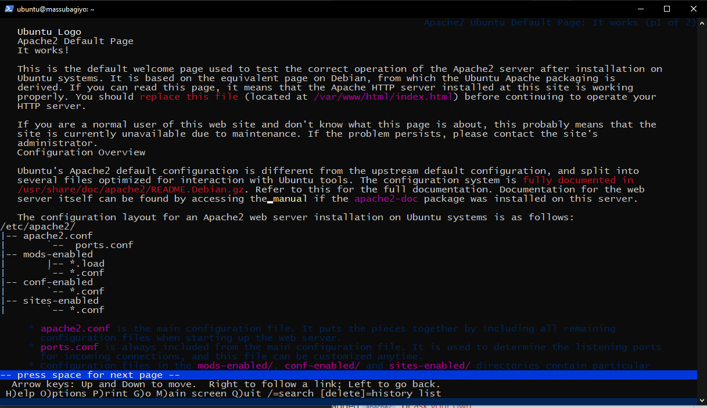

# Linux Shell
#### by Rahmad Subagiyo

---

## 3 Command Shell selain yang ada di Ebook

### 1. whoami

Command `whoami` digunakan untuk menunjukkan user aktif sekarang

### 2. locate

Command `locate` digunakan untuk mencari file dan folder sesuai yang diinputkan

### 3. pwd

Command `pwd` digunakan untuk menunjukkan di folder mana sekarang kita berada

## Perbedaan BASH dengan Shell

| BASH | Shell |
| ----------- | ----------- |
| Bash adalah sebuah script yang khusus diciptakan untuk Bash. | Shell script adalah script yang dapat dieksekusi di berbagai shell. |
| Bash Scripting adalah bagian dari Shell scripting. | Shell script adalah metode untuk mengotomatisasi tugas-tugas sebagai kumpulan perintah. |
| Bash adalah salah satu bentuk Shell Script. | Shell dapat berupa salah satu dari Korn, C shell, Bourne, Bash, dll. |
| Bash adalah kepanjangan dari Bourne-Again Shell dan diciptakan oleh Brian Fox. | Shell Unix asli yang dikembangkan oleh Stephen Bourne. |
| Bash memiliki banyak fitur dibandingkan dengan Shell. | Shell memiliki lebih sedikit fitur dibandingkan dengan Bash. |
| Gunakan shebang, “#!/bin/sh” jika mau menggunakan sh.  | Gunakan shebang, “#!/bin/sh” jika mau menggunakan Bash jika tersedia. |
| Bash lebih programmer-friendly dibandingkan dengan shell. | Shell kurang programmer-friendly dibandingkan dengan Bash. |

## Installasi Apache2

### 1. Jalankan Instance yang akan digunakan
### 2. Jalankan command `sudo apt update` untuk mengupdate repository, `sudo apt update` untuk mengupgrade packages di repository dan `sudo apt install apache2` untuk menginstall Apache2

Tambahan, bisa jalankan command `sudo apt install lynx` untuk tampilan yang lebih bagus

### 3. Untuk check apakah Apache2 sudah terinstall, jalankan command `lynx http://10.0.2.15`

