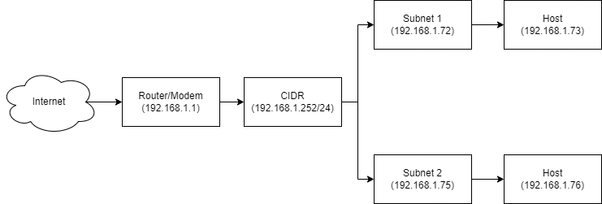

## Perbedaan antara IP Private dengan IP Public, serta IP Dynamic dengan IP Static

### IP Private dengan IP Public

| Pembeda | IP Public | IP Private |
| ----------- | ----------- | ----------- |
| Lingkup Area | Internasional | Lokal |
| Karakteristik | Unik, tidak boleh sama | boleh sama |
| Perolehan IP | dari ISP langganan Internet | dibuat dengan ketentuan sendiri |
| Aksesibilitas | Dapat diakses langsung melalui Internet | Harus melalui router / gateway |
| Kegunaan | Komunikasi antar Jaringan Internet | Komunikasi antar Jaringan lokal | 
| Informasi IP | Diketahui dengan mengunjungi situs seperti whatismyip.com. | Diketahui dengan perintah “ipconfig” pada command prompt |
| Sifat IP | Ada yang bersifat static dan dinamis | Bisa diset manual ataupun otomatis didapat dari DHCP Server |
| Biaya | Berbayar | Gratis |

## Berikut adalah rancangan jaringan dengan spesifikasi sebagai berikut
### - CIDR Block : 192.168.1.xxx/24
### - Subnet : 255.255.255.0
### - Gateway : 192.168.1.1

